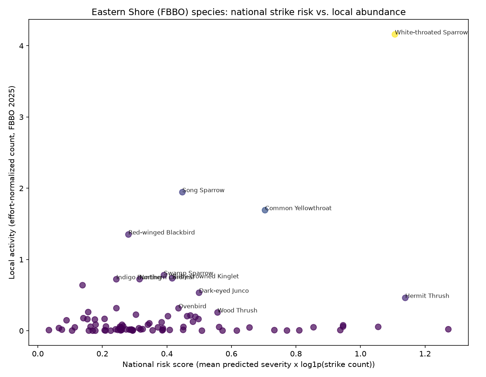

# Eastern Shore Bird-Strike Risk Analysis

## Methodology and limitations

A CatBoost gradient-boosted-tree regressor was trained on the FAA
Wildlife Strike Database (confirmed business/private fixed-wing GA
population) to predict an ordinal damage-severity score (0 = no damage,
1 = minor, 2 = substantial, 3 = destroyed) from strike conditions
(species, engine type, phase of flight, sky/visibility, precipitation,
light condition, warning status, height, speed, season). Validation
RMSE: 0.35, R-squared: 0.32.

Per-species national risk scores (mean predicted severity x
log1p(strike count)) were then joined against effort-normalized 2025
activity from a single Eastern Shore of Maryland banding station
(Trektellen/FBBO). This is exploratory analysis, not a calibrated
probability: one station-season of local data, species-name matching is
approximate for composite/subspecies-tagged Trektellen entries, and a
species' local abundance is not the same as its exposure risk to
aircraft. 37 locally observed
species had no FAA strike-record match and are excluded from the risk
scatterplot below (but are noted separately). More station-years are
expected to refine this analysis.

## Nationwide findings: highest species risk (FAA-wide)

| species | n_strikes | mean_predicted_severity | risk_score |
| --- | --- | --- | --- |
| White-tailed deer | 1042 | 1.24 | 8.60 |
| Unknown bird - large | 704 | 0.89 | 5.83 |
| Turkey vulture | 469 | 0.88 | 5.40 |
| Geese | 175 | 1.00 | 5.16 |
| Mule deer | 70 | 1.21 | 5.15 |
| Canada goose | 784 | 0.76 | 5.06 |
| New World vultures | 195 | 0.93 | 4.92 |
| Black vulture | 126 | 0.99 | 4.78 |
| Snow goose | 31 | 1.16 | 4.04 |
| Unknown bird - medium | 2631 | 0.44 | 3.46 |
| Ducks, geese, swans | 32 | 0.99 | 3.46 |
| Ducks | 222 | 0.64 | 3.45 |
| Double-crested cormorant | 30 | 0.94 | 3.23 |
| Anhinga | 24 | 0.95 | 3.07 |
| Bald eagle | 144 | 0.61 | 3.04 |

## Eastern Shore (FBBO) local risk read

| species | local_activity | risk_score | local_risk_contribution |
| --- | --- | --- | --- |
| White-throated Sparrow | 4.16 | 1.11 | 4.60 |
| Common Yellowthroat | 1.69 | 0.70 | 1.19 |
| Song Sparrow | 1.94 | 0.45 | 0.87 |
| Hermit Thrush | 0.46 | 1.14 | 0.53 |
| Red-winged Blackbird | 1.35 | 0.28 | 0.38 |
| Ruby-crowned Kinglet | 0.74 | 0.42 | 0.31 |
| Swamp Sparrow | 0.78 | 0.39 | 0.30 |
| Dark-eyed Junco | 0.53 | 0.50 | 0.27 |
| Northern Cardinal | 0.72 | 0.32 | 0.23 |
| Indigo Bunting | 0.72 | 0.24 | 0.18 |
| Wood Thrush | 0.26 | 0.56 | 0.14 |
| Ovenbird | 0.32 | 0.44 | 0.14 |
| Yellow-breasted Chat | 0.21 | 0.47 | 0.10 |
| Magnolia Warbler | 0.20 | 0.49 | 0.10 |
| Chipping Sparrow | 0.20 | 0.46 | 0.09 |

## Concluding risk statement

The species combining the highest national strike-severity risk with
the highest local 2025 activity at FBBO represent the greatest plausible
bird-strike concern for GA aircraft operating near this Eastern Shore
station - see the top-right of the scatterplot and the local risk table
above for the specific species driving that read this season.
