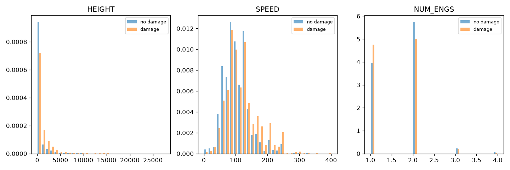
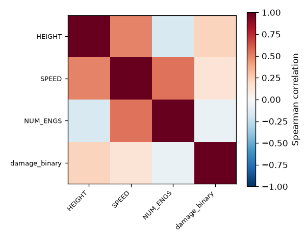
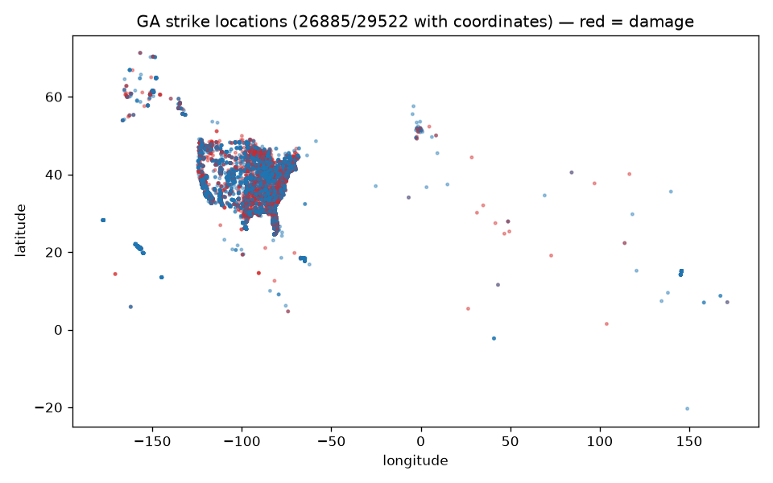
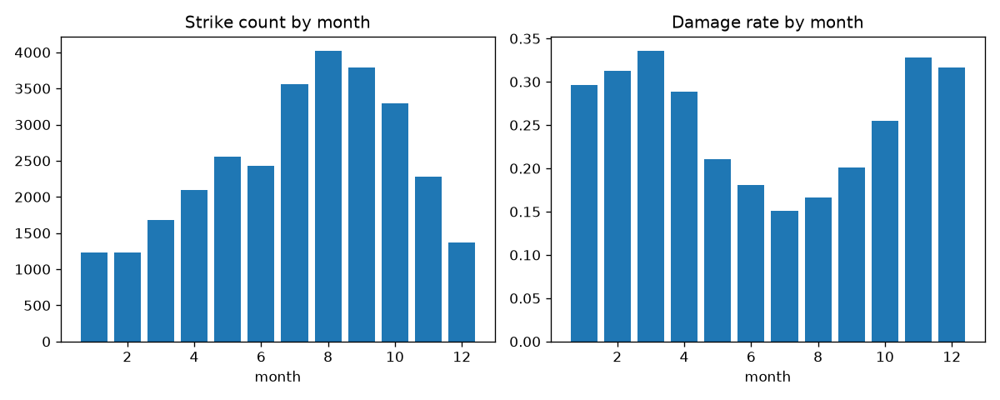

# Exploratory Data Analysis — GA Population

N = 29522 GA strike incidents.

## Missingness (top 10)

| column | % missing |
|---|---|
| NR_FATALITIES | 99.96% |
| BIRD_BAND_NUMBER | 99.81% |
| ENG_4_POS | 99.53% |
| NR_INJURIES | 99.5% |
| ENG_3_POS | 97.32% |
| EFFECT_OTHER | 96.46% |
| ENROUTE_STATE | 95.22% |
| COST_OTHER_INFL_ADJ | 94.29% |
| COST_OTHER | 94.29% |
| PRECIPITATION | 93.45% |

## Distributions by damage outcome

## Correlation matrix (continuous features x damage_binary, Spearman)

Strongest single correlation with damage: HEIGHT (0.224) — association, not causation; see MODELING_APPROACH.md.

## Spatial distribution

## Seasonal pattern

## Confounding checks (species / year / airport)

Overall damage rate: 23.3%
Damage rate range across years: [0.1548, 0.388]
Damage rate range across airports (n>=30): [0.0, 0.6774]

Damage rate varies substantially by species, year, and airport (see ranges above). This confirms these are real confounders the GA model's feature set must account for (it does - species is deliberately excluded per ga/feature_policy.py precisely because it's outcome-adjacent, and airport/year effects are captured indirectly via state/faa_region/season features). Correlation here is association, not causation - e.g. an airport's higher rate may reflect its typical aircraft mix or local habitat, not the airport itself causing damage.

## Leakage smoke test (FORBIDDEN_COLUMNS vs. target)

Confirms the columns `ga/feature_policy.py` excludes are indeed suspiciously associated with the target (as an outcome-describing column should be) — this is evidence the leakage guard is doing real work, not blocking harmless columns for no reason.

| column | finding |
|---|---|
| AOS | correlation with damage: 0.271 |
| BIRD_BAND_NUMBER | correlation with damage: -0.421 |
| COMMENTS | correlation with damage: None |
| COST_OTHER | correlation with damage: 0.186 |
| COST_OTHER_INFL_ADJ | correlation with damage: 0.201 |
| COST_REPAIRS | correlation with damage: 0.007 |
| COST_REPAIRS_INFL_ADJ | correlation with damage: 0.007 |
| DAMAGE_LEVEL | damage rate when present: 0.25744426155918, when absent: 0.00035842293906810036 |
| DAM_ENG1 | correlation with damage: 0.265 |
| DAM_ENG2 | correlation with damage: 0.211 |
| DAM_ENG3 | correlation with damage: 0.041 |
| DAM_ENG4 | correlation with damage: 0.018 |
| DAM_FUSE | correlation with damage: 0.225 |
| DAM_LG | correlation with damage: 0.283 |
| DAM_LGHTS | correlation with damage: 0.175 |
| DAM_NOSE | correlation with damage: 0.271 |
| DAM_OTHER | correlation with damage: 0.319 |
| DAM_PROP | correlation with damage: 0.231 |
| DAM_RAD | correlation with damage: 0.176 |
| DAM_TAIL | correlation with damage: 0.222 |
| DAM_WINDSHLD | correlation with damage: 0.241 |
| DAM_WING_ROT | correlation with damage: 0.647 |
| DISTANCE | correlation with damage: 0.141 |
| EFFECT | correlation with damage: None |
| EFFECT_OTHER | correlation with damage: None |
| ENROUTE_STATE | correlation with damage: None |
| FLT | correlation with damage: -0.016 |
| IMAGE | correlation with damage: None |
| INDEX_NR | correlation with damage: -0.07 |
| INDICATED_DAMAGE | damage rate when present: 0.23314816069371994, when absent: None |
| INGESTED_OTHER | correlation with damage: 0.15 |
| ING_ENG1 | correlation with damage: 0.025 |
| ING_ENG2 | correlation with damage: 0.029 |
| ING_ENG3 | correlation with damage: 0.002 |
| ING_ENG4 | correlation with damage: None |
| LOCATION | correlation with damage: None |
| LUPDATE | correlation with damage: None |
| NR_FATALITIES | correlation with damage: None |
| NR_INJURIES | correlation with damage: -0.032 |
| NUM_SEEN | correlation with damage: None |
| NUM_STRUCK | correlation with damage: None |
| OPID | correlation with damage: None |
| OTHER_SPECIFY | correlation with damage: None |
| OUT_OF_RANGE_SPECIES | correlation with damage: -0.003 |
| PERSON | correlation with damage: None |
| REG | correlation with damage: None |
| REMAINS_COLLECTED | correlation with damage: -0.089 |
| REMAINS_SENT | correlation with damage: 0.025 |
| REMARKS | correlation with damage: None |
| REPORTED_NAME | correlation with damage: None |
| REPORTED_TITLE | correlation with damage: None |
| RUNWAY | correlation with damage: -0.004 |
| SIZE | correlation with damage: None |
| SOURCE | correlation with damage: None |
| SPECIES | correlation with damage: None |
| SPECIES_ID | correlation with damage: None |
| STR_ENG1 | correlation with damage: 0.094 |
| STR_ENG2 | correlation with damage: 0.086 |
| STR_ENG3 | correlation with damage: 0.029 |
| STR_ENG4 | correlation with damage: 0.004 |
| STR_FUSE | correlation with damage: 0.025 |
| STR_LG | correlation with damage: 0.048 |
| STR_LGHTS | correlation with damage: 0.145 |
| STR_NOSE | correlation with damage: 0.001 |
| STR_OTHER | correlation with damage: -0.131 |
| STR_PROP | correlation with damage: -0.002 |
| STR_RAD | correlation with damage: 0.033 |
| STR_TAIL | correlation with damage: 0.109 |
| STR_WINDSHLD | correlation with damage: -0.068 |
| STR_WING_ROT | correlation with damage: 0.272 |
| TRANSFER | correlation with damage: None |
| damage_binary | correlation with damage: 1.0 |
| damage_level_inconsistent | correlation with damage: 0.005 |
| damage_target_status | correlation with damage: None |

## Incident counts vs. exposure — UNAVAILABLE

Phase 7 asks for incident counts plotted against flight exposure (e.g. departures). This project has NO flight-exposure data (see DATA_CARD.md §5, `bts_t100_departures.csv` placeholder) — this section is intentionally left as an explicit gap, not silently omitted, so a reader knows it was considered.
